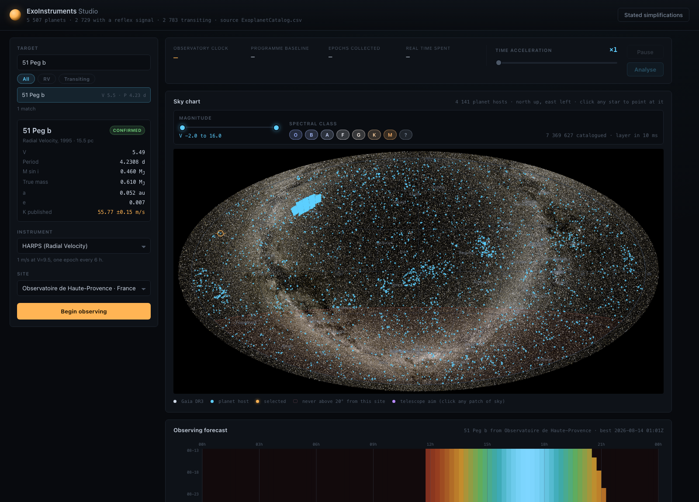
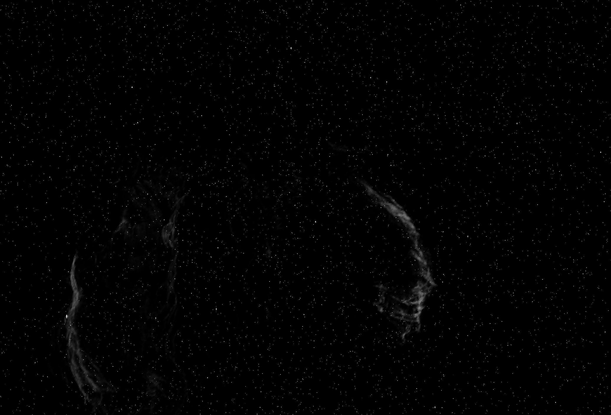
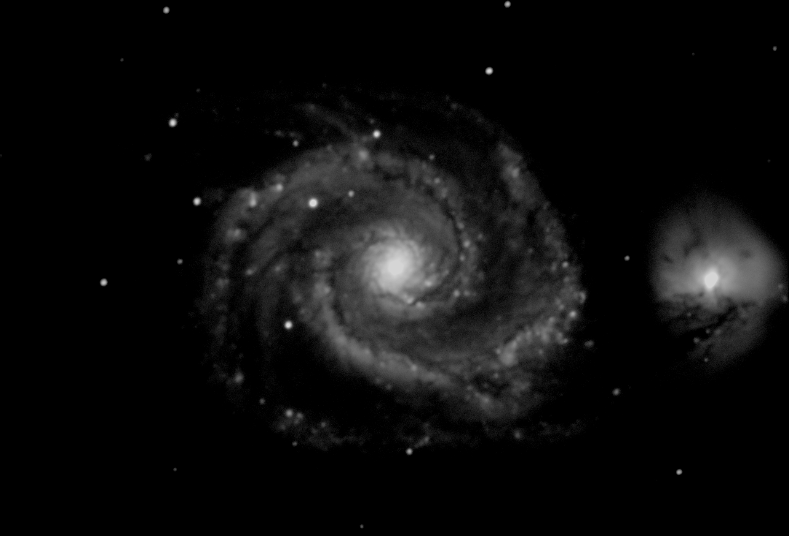
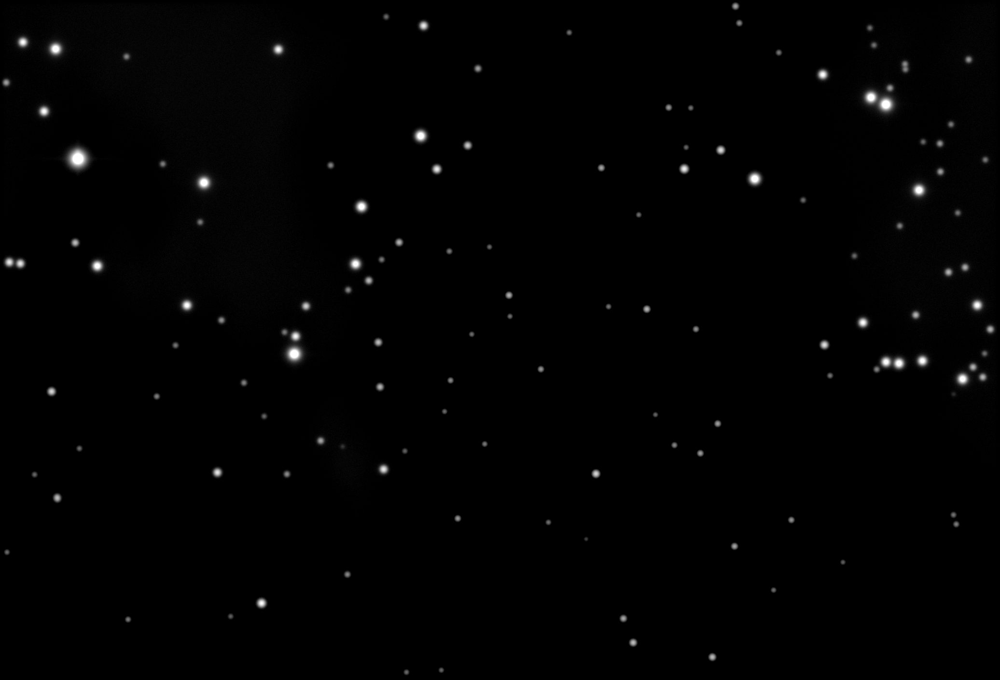
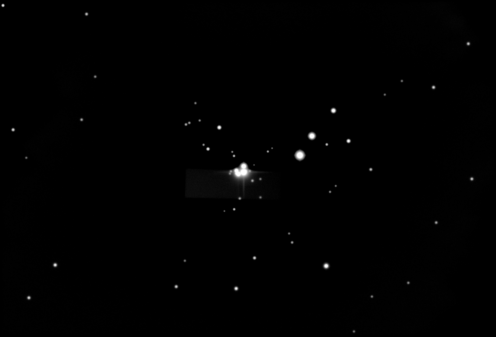
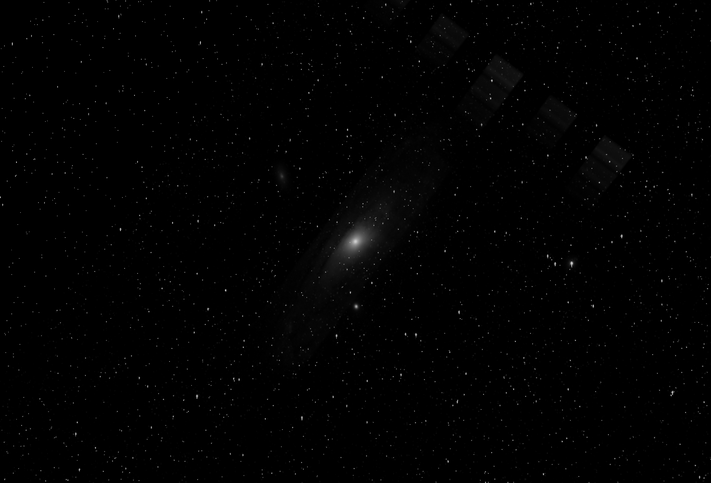
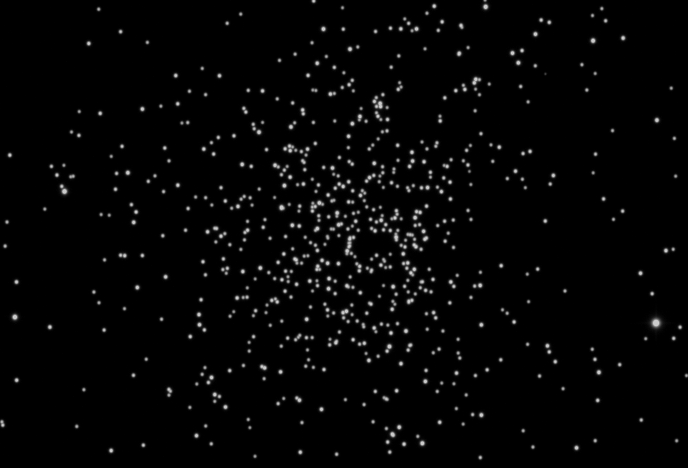

# ExoInstruments Studio

An observatory simulator on the real sky, with the clock in your hands. Point a real telescope
at a real target from a real site, expose, and read out a frame through a physics pipeline that
has been [measured against POPPY, GalSim, Skyfield and dust_extinction](ACCURACY.md).

```bash
./run.sh
```

Then open <http://127.0.0.1:5227>.



*The whole 7,369,627-star Gaia DR3 catalogue on an all-sky chart, 4,141 planet hosts over it, and
the observing forecast for the selected target from the selected site. Click any patch of sky to
aim a telescope at it.*

---

## What comes out of it

Every frame below was produced by this repository, by the command shown under it. No stacking, no
retouching: these are single sub-exposures written straight out of the detector model.

| | |
|---|---|
|  |  |
| **Veil Nebula, [O III], RedCat 51, 900 s** at Roque de los Muchachos. The filaments are NSNS's *measured* [O III] plane, not a ratio inferred from H-alpha. | **M51, luminance, CDK1000, 600 s** at Roque de los Muchachos. The galaxy is measured survey imagery, not a Sersic profile. |
|  |  |
| **Carina, [S II], RC20, 600 s** from Paranal, at airmass 2.5 because that is where Carina was that night. | **M42, H-alpha, RC20, 300 s** from Paranal. The filter admits [N II] 6548 and 6584 alongside H-alpha, as a real 7 nm filter does. |
|  |  |
| **M31, luminance, RedCat 51, 300 s.** 2,383 catalogue stars in the field. | **Omega Centauri, luminance, RC20, 120 s** from Paranal. |

Reproduce any of them:

```bash
curl -s -X POST http://127.0.0.1:5227/api/capture -H 'Content-Type: application/json' \
  -d '{"telescope":"RedCat51","site":"orm","raDeg":313.29,"decDeg":31.72,
       "filter":"OIII","exposureSeconds":900,"binning":2}'
```

The response carries the frame as PNG, a FITS URL, and the numbers behind it: seeing, airmass,
sky electrons per pixel, how many catalogue stars were drawn, and which emission lines the filter
admitted and whether each was measured or derived.

## What this is

A local HTTP server running the [ExoInstruments](https://github.com/batistitooo/ExoInstruments)
physics core on the real sky, driven from a clock we own rather than a game's. The browser is the
interface. It does radial-velocity and transit campaigns against the real exoplanet catalogue, and
deep-sky imaging with five real astrographs.

**It is self-contained.** `Core/`, `Session/` and one file of `Visualization/` are the KSP mod's
physics, vendored into this repository: clone it, run `./run.sh`, and nothing else needs to exist
on the machine. What that trade costs, and the check that stops the two copies drifting apart
unnoticed, is in [CORE_PROVENANCE.md](CORE_PROVENANCE.md).

## Accuracy

Frames that look like photographs prove nothing. [**ACCURACY.md**](ACCURACY.md) is the evidence:
every mechanism run against the code that does it for a living, and the disagreement reported
including where it is large.

| | reference | agreement |
|---|---|---|
| Diffraction, annular pupil | POPPY 1.1.1 | encircled energy **0.002 %** |
| Kolmogorov seeing | GalSim 2.8.5 | profile core **2.3e-4**, FWHM constant **0.03 %** |
| Delivered PSF, sampled instruments | GalSim 2.8.5 | FWHM **0.06 to 0.10 %** |
| Extinction law F99 | dust_extinction 1.5 | **4e-11** |
| Pointing altitude | Skyfield 1.55 | RMS **0.35 deg** |

The last two rows of that table in the full document are failures, and they are the reason to read
it: the RedCat 51 is undersampled at 1.17 px per FWHM and its aperture correction is **60 %
optimistic**, and pointing carries no precession, which is worth 0.35 degrees in 2026. Both are
quantified rather than mentioned.

## The big sky maps

The Gaia catalogue, the dust map, the H-alpha composite and its narrowband patches, the galaxy
catalogue and its imagery are **not** in this repository. They are hundreds of megabytes, none are
redistributable, and each is built on your own machine from the surveys. Studio runs without them,
with correspondingly less sky, and `/api/capture/data` reports exactly which it found.

Point it at them with `EXOINSTRUMENTS_DATA=/path/to/PluginData`, or drop them in `data/`. They are
built by the mod's `tools/setup_data.py`; a KSP install that already has them is found
automatically.

## Why a local server rather than WebAssembly

WebAssembly buys one thing: distribution as a bare URL. It costs a port of every
file-reading path in `Core/`, the parallel sections, and roughly a factor of two in speed.

A local server costs none of that. `Core/` compiles as-is, at full native speed, with
`Parallel` intact. And the distribution argument mostly survives anyway: the same ASP.NET
server deployed on a small box *is* a URL, without any port at all. WebAssembly stays
available later as a **backend swap** rather than a rewrite, because the browser only ever
talks to `/api/*` (see `Engine/Api/Dto.cs`, which is deliberately the portability boundary).

## Layout

```
Core/                     the vendored physics, 122 files, unmodified (CORE_PROVENANCE.md)
Session/                  the vendored session layer, 3 files
Visualization/            one file: FitsWriter.cs
data/                     the two small catalogues that ship; the big maps are found, not shipped
validation/               the cross-validations behind ACCURACY.md
  poppy-crossvalidation/  diffraction against POPPY
  galsim-crossvalidation/ seeing and the delivered PSF against GalSim
  dust-crossvalidation/   the extinction law against dust_extinction
  astrometry/             pointing and airmass against Skyfield
tools/check_core_drift.py diffs the vendored core against a mod checkout
Engine/
  ExoStudio.csproj        compiles Core/** + Session/** from this repository
  Program.cs              the HTTP API and static host
  Simulation/
    SimulationClock.cs    the time authority; the warp invariant lives here
    ObservingSites.cs     real Earth, real observatories: what KSP used to supply
    Campaign.cs           one target + instrument + site + clock
    CampaignRegistry.cs   the 20 Hz ticker
    VisualizationBoundary.cs   the one stub (below)
  Data/
    CatalogService.cs         loads exoplanet.eu, indexes it
    CatalogCrossReference.cs  catalogue columns beyond the loader: published k, omega, tperi
    SkyService.cs             the chart's hosts + IAU names (BSC fallback with no Gaia)
    GaiaLayerService.cs       the 7.4M-star all-sky layer and its cone search
    GaiaCatalogReader.cs      streams the packed catalogue; pinned by Verify
    PointingSearchService.cs  the mod's 30k-target search index, KSP bodies excluded
  Simulation/ (imaging)
    DeepSkyCamera.cs        the astrograph pipeline (Prepare builds the plane, Digitise reads it out)
    ObservingPlan.cs        the porkchop grid, graded for every method
    CaptureStore.cs         finished frames, served as FITS by the mod's own writer
    PngWriter.cs            dependency-free PNG (gray + RGB)
    UnityShims.cs           Mathf/Color, so three mod Visualization files compile verbatim
  Api/Dto.cs              the wire format
web/                      the interface: no build step, no dependencies, no CDN
Verify/                   the 66th harness (the mod's tools/ holds 65)
```

## Coupling, measured

This is what the split with the mod looked like when the core was vendored, and it is why the
split is where it is. Of the mod's ~59 000 lines:

| | lines | needed changing |
|---|---|---|
| `Core/` (123 files) | 36 000 | nothing, bar one enum (below) |
| `Session/` | 400 | nothing |
| `Visualization/` deep sky | 3 300 | not ported yet; uses Unity only as `Color`/`Mathf` |
| `Visualization/SolarSystemCameraTexture.cs` | 6 400 | genuinely KSP-bound (clones the game's cameras) |
| KSP layer (`Flight/`, GUI, scenario) | 12 700 | replaced by this project |

`Core/` contains exactly **one** file that uses `UnityEngine`: `SkyChartTexture.cs`, excluded
in the csproj.

### The one boundary stub

`Core/VisualTelescopeCatalog.cs` opens with `using ExoInstruments.Visualization;` because
`VisualTelescopeSpec.AvailableFilters` is a `CameraFilter[]`. That enum is pure data, but it
is declared inside the 6 400-line Unity camera file, so `Core` cannot compile without Unity
over one enum. `Engine/Simulation/VisualizationBoundary.cs` supplies it.

**The real fix, worth doing in the mod after the release:** move `CameraFilter` into `Core`
and delete the stub. It is a cut-and-paste with no behaviour change, and it removes the last
non-Unity reason `Core` is not standalone. `Verify` asserts member-for-member that the stub
still matches the mod's declaration, so the two cannot drift apart unnoticed.

## The warp invariant

> Warp changes the pacing of a run, never its result.

`Core` is already built for this: every entry point takes a `double ut`, and neither `Core`
nor `Session` calls `Planetarium.GetUniversalTime()` even once. All 17 calls live in the KSP
layer. So the server simply owns the clock, and `SimulationClock.Advance()` is the only place
wall-clock time enters the system.

The corollary for exposures: an exposure of E simulated seconds integrates E seconds of
photons at every warp rate and finishes after E / warp seconds of real time. In the KSP
camera a 300 s frame was a 300 s real wait that warp could not touch; that coupling belonged
to the KSP layer, not to the physics, and it does not survive detaching.

`Verify` proves the invariant in its strongest form: identical epoch sequences, bit for bit,
across warp rates from 1e3 to a single 400-day jump, at tick slices from 10 ms to 250 ms.

## A physics finding

`StarTarget.EstimatedRvSemiAmplitudeMps` computes the standard mass function, whose mass term
is **M sin i**. `ExoplanetCsvLoader` fills `PlanetMassJupiter` with `mass ?? mass_sini`,
preferring the *true* mass when the catalogue has one. Where the two differ, the injected
reflex signal is wrong by 1/sin i.

Checked against the catalogue's own published `k` column, for 51 Peg b:

| mass term used | K | error vs published 55.77 ± 0.15 m/s |
|---|---|---|
| M sin i = 0.46 M_J | 56.66 m/s | **1.6 %** |
| true mass = 0.61 M_J | 75.13 m/s | 34.7 % |

The formula is right; the input was not. The residual 1.6 % is entirely the catalogue's
rounding of `mass_sini` to two decimals.

360 catalogue entries carry both masses and 168 differ by more than 10 %, reaching 30x on
astrometrically-constrained low-inclination systems (HD 181720 b at i = 1.75°). Entries with
only a true mass are overwhelmingly transiting planets, where sin i is 1 and the distinction
does not arise.

**Studio corrects this in the loading layer** (`CatalogService.ApplyMinimumMassCorrection`,
230 entries at present), which is the same division the mod already uses: the CSV loader is
pure and the glue layer reads the file. **The mod itself is untouched.** The equivalent fix
inside `Core` is to have the loader keep both columns and let the formula pick.

## The whole Gaia catalogue on the chart

All 7 369 627 stars, not a decimated subset. That many will not travel as JSON nor draw at
interactive speed in a canvas, so the sky layer is **rendered server-side** into a Hammer
projection and the browser composites its own overlay on top, which is exactly what the mod
does with `Core/SkyChartTexture` (render to a texture, hand the UI pixels). Only the pixels
moved; the projection and the physics are the same.

- **Colour is measured, not assigned.** B-V gives an effective temperature (Ballesteros
  2012, via Core's `StellarColor`), the temperature gives an sRGB tint through the full CIE
  chain. Saturation is lifted for the chart only, and only away from neutral: hue and
  ordering are untouched, and photometry never sees that table.
- **Filters mean what the mod means.** The magnitude band and the O/B/A/F/G/K/M class chips
  cut on Core's own MK boundaries. Switching to O+B leaves a thin trace of the galactic
  plane (young stars have not left their birthplaces); switching to M leaves an all-sky
  scatter (old, mixed population). Entries with no measured colour are their own class
  rather than a guess.
- **Brown dwarfs are absent and said to be.** This catalogue's depth does not reach
  substellar objects, so there is no such filter to offer.
- **The chart pans and zooms.** Drag to move, wheel to zoom about the cursor, double-click
  to reset. The layer is an image and the graticule and markers are canvases, so all three
  go through one `skyGeom` viewport or the stars would slide out from under their labels;
  past ×1.6 the server re-renders at 4000 px so magnification stays sharp. A drag that moved
  is not delivered as a click, so panning and pointing do not fight over the same gesture.

- **Every star stays pointable.** The layer cannot be hit-tested, so pointing does not go
  through it: a click inverts the projection to a sky position and
  `RenderedStarCatalog.Search` resolves it, the same cone search the camera uses to decide
  what lands on the sensor. The brightest star inside the click's tolerance wins, and the
  panel names its V, B-V, temperature and class.

`Engine/Data/GaiaCatalogReader.cs` is the one place Studio duplicates a format the mod owns
(the chart needs every star once; `RenderedStarCatalog` only answers cones, and a 180-degree
cone materialises ~350 MB of structs). It is pinned rather than trusted: Verify cross-checks
it against the mod's own reader over a real field and requires exact agreement.

A full render costs about 1.4 s and is cached per filter. The first version took 78 s,
all of it integrating Planck against the CIE observer seven million times; a 512-bin colour
table over B-V removed it.

## Two findings from a square box around a star

Both came out of chasing one report, "why is there a bright square around the stars on the
RC20", and neither was where it looked.

**The display black point was below the sky.** The PNG stretch put black at the frame's 25th
percentile, which sits *under* the sky median (measured: 21 ADU under a sky of 3348 on an
RC20 frame at binning 8). That spends the bottom of the display range on sky noise and lifts
the very faintest rim of a bright star's halo into visible grey, and that rim is where the
PSF kernel's finite square array support ends. So a saturated star wore a square box. The
halo is round in the data: the kernel is clipped to a disc with corners exactly zero, the
ADU isophotes fit a circle at every threshold, and a synthetic single star through the same
convolution and detector comes out round. It was the display drawing the kernel's own edge.
Black is now the sky itself, found as median + one MAD-based sigma, and the box is gone.

**The installed Gaia catalogue renders an empty sky, silently.** Chasing the first finding
turned up frames with no stars at all. The catalogue loads, reports its full 7,369,627 stars
and decodes every record correctly (RA 0-360, Dec within range, V 4.7-16.6), but its
declination band index is wrong: 91 of 1800 bands hold anything, and 4,866,838 stars, two
thirds of the file, sit in one band at dec +89.9. `RenderedStarCatalog.Search` reads only the
bands its cone overlaps, finds them empty, and returns nothing, with no error anywhere, in
the game as much as here. `GaiaCatalogReader.ValidateBandIndex` now checks this at load and
says so in `/api/capture/data`, because an empty frame is otherwise indistinguishable from a
genuinely empty field. The fix belongs in the mod's `tools/pack_gaia_catalog.py`.

## The feature loop (2026-08-12, afternoon)

Ported from the mod, each stage validated before the next:

- **FITS export.** Every frame downloads as real 16-bit FITS written by the mod's own
  `FitsWriter` (compiled verbatim through `UnityShims.cs`): WCS that astropy round-trips to
  the pointing, EGAIN/RDNOISE/MAGZERO/RANDSEED, N.I.N.A-style file names. **Studio does not
  stack.** It used to drive the mod's `AstroImageStack` and `ColourComposite`; those are no
  longer compiled here, because the frames are FITS and Siril reduces them, which is what an
  observer would actually do.

- **The Barlow is the zoom, and it is optical.** `MinFovDeg = MaxFovDeg / BarlowFactor`, the
  mod's own relation. The slider runs the element in and out, so the field and the plate
  scale both follow: the RC20 goes 19.0′ to 4.8′ across, the CDK1000 11.0′ to 2.7′, FORS2
  8.6′ to 4.3′. Instruments that fly what they launched with (the RedCat 51 at 263.8′,
  SPHERE at its real 6″ ZIMPOL field) have no range and the control disappears.
  Captures used to force the Barlow fully in, which is why the RC20's field was a keyhole.
  **It grades radial velocity, which Core does not.** `ObservingForecast.Compute` returns a
  flat `quality = 1.0` for RV, which is why that calendar was a solid slab with no structure
  in it. A spectrograph is not indifferent to airmass: its per-epoch precision is photon
  limited, and the same `1/airmass^2` efficiency Core already applies to imaging is the
  honest grade for it too, as `ImagingObservingConditions` itself documents ("one hour at
  X=2 is about 15 minutes at zenith"). `Engine/Simulation/ObservingPlan.cs` is Core's grid
  with that one branch closed; the transit metric is still Core's own noise model. **The mod
  deserves the same three-line fix.**

- **The cooler is a control again.** Detector temperature is a slider on the instruments
  that have one (RC20, RedCat 51 and CDK1000 all carry a 35 K delta below their site's
  ambient; FORS2 and SPHERE do not). It is not a label: the setpoint feeds
  `DarkCurrentModel`, which scales the published dark current by the depletion generation
  law, so on a 300 s RC20 frame the choice runs from 30 e-/px at -23 C to 973 e-/px at
  +11 C, and the frame's noise follows.

## Verification

```bash
cd Verify && dotnet run
```

20 checks: the boundary stub against the mod, the minimum-mass correction against the
published K, warp invariance across five configurations, sky geometry on a real Earth
(culmination altitude, and a sidereal day distinguishable from a solar one), 51 Peg b
recovered end to end, and the streaming Gaia reader against the mod's own cone search.

That harness checks Studio against **itself**. The physics is checked against **other people's
code** in `validation/`, reported in [ACCURACY.md](ACCURACY.md):

```bash
python3 -m venv validation-env
./validation-env/bin/pip install numpy scipy astropy poppy skyfield galsim dust_extinction
cd validation/poppy-crossvalidation && dotnet run && ../../validation-env/bin/python compare_poppy.py
```

And the vendored core against the mod it came from, when a mod checkout is present:

```bash
python3 tools/check_core_drift.py --mod /path/to/ExoInstruments/ExoInstruments
```

## Stated simplifications

Surfaced in the interface, not buried here.

- `ImagingObservingConditions.Evaluate` holds the Sun at declination 0 ("stock KSP bodies
  have no axial tilt"), so night length is equinox-like all year. It does not affect a
  recovered period or amplitude. **First thing to close**: it needs a solar declination on
  `ImagingObserverContext`, an additive change to `Core`.
- Orbital phases come from the catalogue's arbitrary `PlanetPhaseOffset01`, not a real epoch
  of periastron. Periods and amplitudes are real; absolute phase is not.
- Weather is excluded by design, as in the mod.
- Sessions construct `new Random()` unseeded, so a run is not reproducible. Epoch times are
  fully deterministic (which is what the warp invariant is asserted on), but the noise draw
  is not. For a tool aimed at people who publish, a seed on the session constructors is worth
  having.

## The visual telescopes (RC20, RedCat 51, CDK1000, FORS2, SPHERE)

The full astrograph roster, in deep-sky imaging mode. `Engine/Simulation/DeepSkyCamera.cs`
transplants the deep-sky half of the mod's capture pipeline stage for stage, Gaia star
field, measured galaxy maps, narrowband emission with the real per-line electron
coefficients, ESO airglow sky, chromatic PSF with atmospheric dispersion, and the
Poisson/dark/read/bias/blooming detector chain, against the same Core entry points,
the same way `tools/capture-profile` already reproduces it for timing.

Emission lines follow the mod's rule: a line a patch MEASURES is read from that patch's
own plane, and only a line with no measurement is derived from H-alpha through
`NebularLineRatios`. That distinction is the difference between data and an inference
from data, so the frame names it, `[O III] 5007 (measured)` against a bare `[S II] 6731`.
It matters more than it sounds. The port originally derived every line, which meant
[O III] was admitted by the filter and then deposited nothing, since `RatioToHalpha`
returns NaN for it by design, so an [O III] frame came out empty even over the thirteen
northern patches where NSNS measures it. Veil East, extended contrast against the sky:
[O III] 0.7 before and 6.7 after, [S II] 4.9 and 9.5. The [S II] shift goes the way the
physics demands, a supernova remnant's shocks raising [S II]/H-alpha well above the
warm-ionised-medium relation the derived model assumes. Southern patches are SHASSA and
carry H-alpha alone, so nothing there changed.

A capture is scheduled, not immediate: the server finds the coming night's best moment
for the field (max altitude, Sun below nautical twilight) and timestamps the frame with
it. Asking for M51 at noon returns tonight's frame.

Data files are searched in the installed KSP `PluginData` first, then the pre-reinstall
backup (which is where the user-built `GaiaStarCatalog.starcat` currently lives). What
was actually loaded is reported at `/api/capture/data` and shown in the panel.

Declared omissions (also served by the API): no solar-system bodies (that half really
does need KSP's renderer), flat polar zodiacal constant, new moon assumed, detector
cosmetics (flat field, FPN, fringing, cosmic rays, CTI) left out, unity gain.

**A mod bug found here:** interacting pairs whose measured maps each swallowed the other
(M51 + NGC5195 in the shipped `galimg`, both the fresh and the backup build) are BOTH
skipped by `DepositGalaxies`' coverage test, so in-game the M51 field renders neither
galaxy. Studio adds the missing tie-break (brighter member deposits, its map total
already folds the companion's flux); the corresponding mod fix is filed as a background
task.

## Not ported

- Solar-system photography proper: the mod photographs KSP's own rendered planets by
  cloning `Camera ScaledSpace`; without KSP there is nothing to clone.
- Direct imaging, which the mod itself flags `UnderConstruction`.
- The orbital platform (space telescope) imaging path: a different constraint model,
  not just a missing atmosphere.
- Career, parts, vessels, unlock economy. Deliberately: this is an instrument tool.

## Next

**Step 2, agreed but not built:** NativeAOT-compile the same `Core` to a native shared
library behind a flat C ABI, wrapped as a pip-installable module. `import exoinstruments`
with no .NET runtime, no rewrite, and no revalidation. That is what makes the engine usable
from a notebook, which is the form astronomy actually consumes software in.
